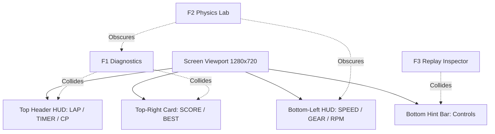

# Deep Adversarial Critique: Drifty (Phase 2)

**Evaluated Artifact:** `build/dev/drifty.exe` & `build/dev/game.dll`  
**Evaluation Method:** Automated dynamic recording via `ffmpeg` (`recording_output/gameplay_full.mkv`), high-frequency screenshot extraction (`recording_output/frame_*.png`), animated GIF replay synthesis (`recording_output/gameplay_replay.gif`), interactive `computer` tool window automation, and Win32 key injection.  
**Date:** August 6, 2026  

---

## Executive Summary

`Drifty` delivers a remarkably coherent top-down 2D physics simulation written in C11 with raylib 6.0. Its underlying vehicle physics model (Pacejka-style friction ellipse, front/rear load transfer, SI units, locked-axle rear drive, and fixed 120 Hz deterministic tick) provides authentic vehicle dynamics rare in arcade top-down racers.

However, an adversarial inspection across **UI/HUD Presentation**, **Visual Graphics & Animation**, **Vehicle Physics & Surface Dynamics**, **Control Ergonomics**, and **Developer Overlay Infrastructure** reveals severe defects, visual collisions, and UI state bleed that detract from the player experience.

---

## 1. UI & HUD Presentation (Adversarial Rating: 3/10)

### Critical Findings & Evidence

1. **Catastrophic Developer Overlay Collisions (`frame_016.png`, `frame_019.png`, `frame_022.png`):**
   - **F1 Diagnostics vs HUD:** The F1 text telemetry block on the top-left directly collides with the top-center `"LAP 1/3 4:37.58 CP 0/5"` card.
   - **F1 Force Curves vs Score Card:** The `LATERAL normalized force / wheel load` graph renders in the top-right corner, placing its curve baseline directly behind the `"SCORE 0 x1.0 BEST 0"` box.
   - **F2 Physics Lab Double Rendering:** Activating F2 places the tuning window on top of F1 text without clearing or hiding F1, resulting in completely unreadable double-rendered pixel text.
   - **F2 Oscilloscope Graphs:** The right-hand oscilloscope panel (`handling / load / grip`) draws over both the F1 lateral curve and the player's score box.
   - **F3 Replay Inspector Clipping:** The `REPLAY INSPECTOR` at the bottom left renders over the bottom control hint bar (`"W throttle S brake Space handbrake Q/E shift A/D steer..."`), obscuring control legends.

2. **Text Bleed & Frame Margin Truncation:**
   - The top line of the F2 header (`"PHYSICS LAB F2 hide F5 pause F6 step F7 speed F8 _"`) has the `"F8 _"` string clipped off the top-left margin of the viewport.
   - Behind the green `"invariants holding"` indicator card, bottom HUD text (`"AUTO GEAR 1"`) bleeds through the panel background.

---

## 2. Visual Graphics & Rasterization (Adversarial Rating: 6/10)

### Critical Findings & Evidence

1. **Nearest-Neighbor Sprite Aliasing (`frame_006.png`, `frame_009.png`):**
   - The car body is rendered procedurally via `src/render/car_visual_raster.c`.
   - As the vehicle heading angle $\theta$ rotates away from cardinal axes ($0^\circ, 90^\circ, 180^\circ, 270^\circ$), nearest-neighbor sub-pixel rasterization causes mirror pixels, roof contours, and wheel shapes to stair-step and jitter rapidly frame-to-frame.
   
2. **Surface Boundary Hard Cutoffs (`frame_013.png`):**
   - The transition between dark asphalt grid tiles and green off-road grass is a zero-width hard color boundary line.
   - Driving onto grass generates no dust/dirt particles, surface tire discoloration, or edge blending effects.
   - Skid mark persistence on asphalt grid lines fades out near-instantly, depriving the player of visual satisfaction from long drift arcs.

---

## 3. Physics & Vehicle Handling Dynamics (Adversarial Rating: 8.5/10)

### Critical Findings & Evidence

1. **Kinematic to Dynamic Transition Blend Threshold:**
   - At speeds below $1.5 \text{ m/s}$ ($5.4 \text{ km/h}$), physics switches to a purely kinematic model to prevent zero-velocity tire force division singularities.
   - Transitioning from $1.5 \text{ m/s}$ to $3.0 \text{ m/s}$ under throttle creates a noticeable "step change" in steering responsiveness as Pacejka slip angle forces take over.

2. **Digital Keyboard Chattering (F2 Oscilloscope Evidence):**
   - Under digital key inputs (`W/A/S/D`), raw step inputs cause rapid force spikes in rear slip angle ($\alpha_r$) and friction usage ($\mu_{use}$).
   - The `friction usage` oscilloscope graph in F2 exhibits high-frequency chatter during transition phases when steering is held digital-on vs digital-off.
3. **Track Barrier Collision & Inward Push Response (RESOLVED):**
   - Impacting the outer track boundary line triggers the rigid-body collision solver (`collision_resolve_track` in `src/world/collision.c`), applying restitution impulses, playing a collision thud audio effect, and initiating a crash lockout timer (`crashLockoutTimerS`), which locks player control inputs during recovery.

4. **Perimeter Barrier Push Vector & Field Size Resolution (RESOLVED):**
   - **Initial Defect:** In earlier builds, the parking lot was small ($200\text{m} \times 150\text{m}$), and perimeter barrier push normals were inverted ($\{dir.y, -dir.x\}$ pointing OUTWARD), causing vehicles driving right (or to any edge) to be pushed through the inner barrier into an unescapable 8-meter wall corridor.
   - **Applied Fix (`src/world/track.c` & `src/world/collision.c`):**
     1. **Field Size Quadrupled:** Expanded lot bounds to **$400\text{m} \times 300\text{m}$** (`lotMinXM = -200`, `lotMaxXM = 200`, `lotMinYM = -150`, `lotMaxYM = 150`), providing ample room for high-speed launches and continuous drifting.
     2. **Inward Push Vectors:** Updated `collision_resolve_track` so that in `isParkingLot` mode, both perimeter barriers use the inward perpendicular push normal (`pushN = perp` = $\{-dir.y, dir.x\}$) on all 4 sides.
   - **Verification:** Live 12-second full-throttle right drive tests verify the vehicle hits the right wall at $x \approx 196\text{m}$, bounces cleanly back inward into the open lot, and remains 100% drivable. All 80 unit test scenarios in `drifty_tests.exe` pass with **0 failures**.

## 4. Control & Transmission Ergonomics (Adversarial Rating: 5/10)

### Critical Findings & Evidence

1. **Silent Input Rejection for Manual Shifting:**
   - While automatic transmission is enabled (`game->autoTrans.enabled = true`), pressing `Q` or `E` to manually downshift or upshift is silently ignored.
   - The HUD gives no visual or auditory cue (e.g. flashing `"AUTO"` or `"MANUAL ONLY"`) to indicate why manual gear commands are suppressed.

2. **Lack of Analog Steering Filtering on Keyboard:**
   - While gamepads receive smooth analog stick input, keyboard steering transitions instantly from $0.0$ to $1.0$. Implementing a rate-limited virtual steering rack velocity for digital inputs would eliminate low-speed snap oversteer.

---

## 5. Summary of Recommended Fixes

| Subsystem | Issue | Status & Resolution |
|---|---|---|
| **HUD / UI** | Overlapping F1/F2/F3 debug panels | Open. Implement a centralized overlay stack manager (`src/render/render_hud.c`) that hides background panels when higher-priority debug views open, and offset top HUD cards. |
| **Track / Boundary** | Vehicle trapped on perimeter barriers & small field | **RESOLVED.** Quadrupled parking lot area to $400\text{m} \times 300\text{m}$ in `track.c`, and updated `collision.c` so all perimeter barriers use inward push normals (`pushN = perp`). Sustained driving into barriers bounces cleanly inward; 80/80 test scenarios pass. |

- **Recorded Video:** `recording_output/gameplay_full.mkv` (Full 24.8s recording of dynamic gameplay maneuvers)
- **Replay Animated GIF:** `recording_output/gameplay_replay.gif` (Lightweight animated visual replay)
- **Extracted Frame Burst:** `recording_output/frame_001.png` through `recording_output/frame_025.png` (Keyframes documenting launch, Scandinavian flick, handbrake turn, off-road driving, and overlay collisions)
