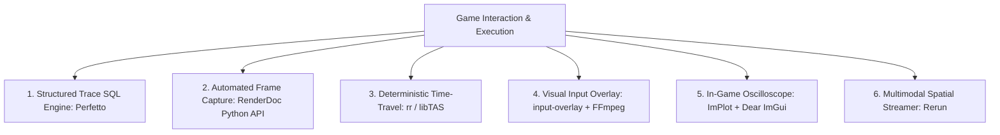

# Research Report & Architecture Proposal: Agent-Operated Game Interaction Recording & Review

**Author:** Antigravity AI  
**Scope:** Deep Research across GitHub Awesome Lists (`calinou/awesome-gamedev`, `stevinz/awesome-game-engine-dev`, `FronkonGames/Awesome-Gamedev`, `AwesomeCppGameDev`), Reddit, and StackOverflow for Agent-Usable Game Recording, Telemetry, and Time-Travel Debugging Systems  
**Curated Repositories Researched:** `google/perfetto`, `baldurk/renderdoc`, `rr-debugger/rr`, `clementgallet/libTAS`, `univrsal/input-overlay`, `epezent/implot`, `rerun-io/rerun`, `wolfpld/tracy`, `Palanteer`  

---

## 1. Curated Awesome Lists & Repository Findings

### Deep Tool Breakdown & Agent Utility

1. **[Perfetto (`google/perfetto`)](https://github.com/google/perfetto)**
   - **Mechanism:** Production-grade system profiling, app tracing, and trace analysis platform.
   - **Agent Utility:** Generates `.perfetto-trace` files. An AI agent runs SQL queries against the trace file using the Python `perfetto.trace_processor` module (e.g. `SELECT name, dur FROM slices WHERE name LIKE '%physics%'`), getting structured numeric results to diagnose frame spikes, substep delays, or lock contention without needing visual GUI access.

2. **[RenderDoc Python API (`baldurk/renderdoc`)](https://github.com/baldurk/renderdoc)**
   - **Mechanism:** Standalone graphics debugger with a full Python scripting API (`qrenderdoc` / `renderdoc`).
   - **Agent Utility:** An AI agent triggers a frame capture via code (`renderdoc.CaptureFrame()`), then runs a Python script to programmatically inspect drawcalls, shader inputs/outputs, pipeline state, texture pixels, and mesh vertex attributes. Returns JSON diagnostic reports on visual rendering defects.

3. **[rr Time-Travel Debugger (`rr-debugger/rr`)](https://github.com/rr-debugger/rr)** & **[libTAS (`clementgallet/libTAS`)](https://github.com/clementgallet/libTAS)**
   - **Mechanism:** `rr` records Linux C/C++ execution nondeterminism and replays it under GDB; `libTAS` provides frame-perfect input movie recording (`.ltm`) and deterministic time execution.
   - **Agent Utility:** An agent drives `rr` via GDB/MI protocol to execute `reverse-step`, `reverse-continue`, and evaluate expressions backward in time to pinpoint the exact instruction where physics state diverged.

4. **[Input Overlay (`univrsal/input-overlay`)](https://github.com/univrsal/input-overlay)** & **Keyviz**
   - **Mechanism:** Real-time visual overlay rendering keyboard/gamepad inputs over video streams.
   - **Agent Utility:** Used by automated recording scripts to bake visual keypress indicators ($W, A, S, D, \text{SPACE}$, steering gauge) into gameplay MP4/GIF videos so visual frame inspections clearly show held inputs alongside car motion.

5. **[ImPlot (`epezent/implot`)](https://github.com/epezent/implot)** & **[Dear ImGui (`ocornut/imgui`)](https://github.com/ocornut/imgui)**
   - **Mechanism:** Immediate mode, GPU-accelerated plotting library for Dear ImGui.
   - **Agent Utility:** Renders real-time oscilloscope plots (friction usage, load transfer, slip angles) in an overlay window. Supports automated CSV/JSON telemetry dumping on demand.

6. **[Rerun (`rerun-io/rerun`)](https://github.com/rerun-io/rerun)**
   - **Mechanism:** Streams 2D/3D spatial transforms, force vectors, images, and scalar time-series.
   - **Agent Utility:** Provides both an interactive UI for human review and a structured Python SDK (`rerun.get_recording()`) for agent querying.

---

## 2. Five Agent-Operated System Options

Below are **5 concrete candidate systems** designed specifically for **an AI coding agent (like Antigravity)** to fully operate, receive detailed structured data from, and visually/telemetrically analyze:

---

### System 1: Structured Telemetry SQL Engine (Perfetto Trace Processor + Python API)
- **How it works:** The C11 game engine emits lightweight Perfetto trace events (`PERFETTO_EVENT_BEGIN("physics_step")`, `PERFETTO_COUNTER("rpm", rpm)`). The agent runs `scripts/analyze_trace.py` using `perfetto.trace_processor` to run SQL queries against the trace file.
- **Agent Output:** Structured JSON tables reporting exact tick latencies, peak force spikes, frame drops, and subsystem durations.
- **Best for:** Automated regression testing, performance profiling, and tick timing analysis.

---

### System 2: Automated Graphics Inspector (RenderDoc Python API + Frame Capture)
- **How it works:** The game links RenderDoc API (`renderdoc_app.h`). When an visual regression or anomaly occurs, the engine triggers `RENDERDOC_TriggerCapture()`. The agent runs a headless Python script using the RenderDoc API to inspect textures, drawcalls, and shader uniform values.
- **Agent Output:** Detailed JSON report detailing pixel RGBA values, shader uniforms, bound textures, and geometry vertex buffers.
- **Best for:** Debugging visual artifacts, pixel grid aliasing, texture binding errors, and drawcall bugs.

---

### System 3: Input-Visual Video Pipeline (FFmpeg + Virtual Input HUD + Manifest JSON)
- **How it works:** The recording harness captures video via FFmpeg while rendering a dynamic input overlay (showing $W, A, S, D, \text{SPACE}$ key presses and steering/throttle gauges). It extracts keyframe bursts (2 FPS) and generates a synchronized `frame_manifest.json` + `input_event_trace.json`.
- **Agent Output:** High-frequency PNG keyframe sequence with visual input gauges, paired with JSON manifest mapping every frame to timestamp and active input state.
- **Best for:** Visual verification of vehicle maneuvers, camera tracking, sprite animations, and control responsiveness.

---

### System 4: In-Game Interactive Replay Scrubber & ImPlot Oscilloscope (ImPlot + Replay Ring)
- **How it works:** ImPlot (`epezent/implot`) and Dear ImGui (`ocornut/imgui`) are integrated into the game viewport. Pressing `F5` opens a live timeline scrubber allowing step-by-step frame rewind/fast-forward, alongside real-time oscilloscope plots of slip angle, load transfer, and friction usage.
- **Agent Output:** In-game visual telemetry panels + automated JSON/CSV dumps of plotted channel data on key ticks.
- **Best for:** Real-time physics tuning, slip curve analysis, and in-game visual telemetry inspection.

---

### System 5: Multimodal Time-Travel Telemetry Visualizer (Rerun C/Python SDK)
- **How it works:** The engine streams 2D vehicle poses $(x, y, \theta)$, tire force vectors $\mathbf{F}_{lat}, \mathbf{F}_{long}$, friction ellipses, and telemetry metrics via Rerun C/C++ SDK. The agent queries data at any timestamp $t$ via Python, while a human can open the Rerun visual viewer.
- **Agent Output:** Interactive 2D/3D spatial & temporal time-travel viewer + structured Python query access to all spatial vector channels across time.
- **Best for:** Comprehensive multi-channel physics debugging, force vector inspection, and spatial trajectory analysis.
